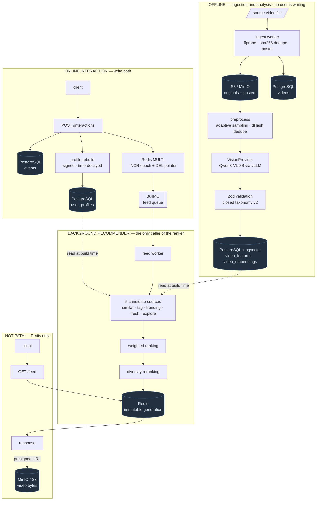
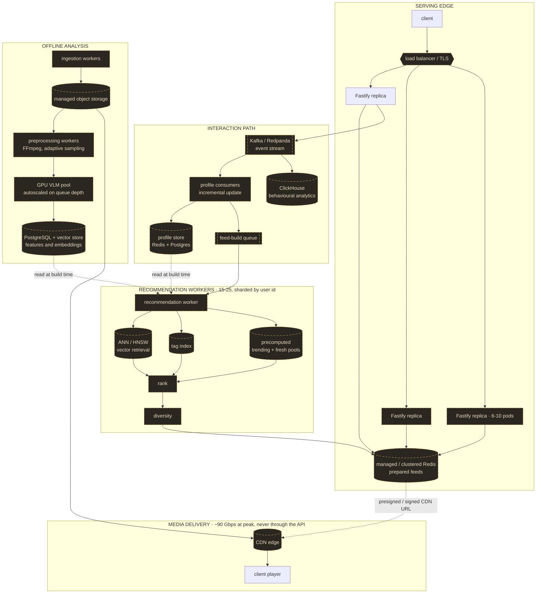

# Architecture

A personalised feed for vertical short-form video: ingestion, vision-model analysis
into a closed taxonomy, a two-stage recommender, and a Redis-served feed.

**How to read this document.** Everything under "Implemented" is running code with
tests behind it. Everything under "Design" or marked *future* is reasoned about and
deliberately **not** built — the MVP is a one-week assignment, and a component with no
consumer is architecture theatre. Where the two are adjacent, the text says which is
which rather than leaving it to tone.

Measured figures are labelled **MEASURED**; extrapolations **PROJECTED**; vendor
prices and ratios **ASSUMED**. Nothing here has been load-tested at 3,000 RPS — that
section is a design target and arithmetic, not a benchmark result.

---

## Contents

1. [Current MVP architecture](#1-current-mvp-architecture)
2. [Ingestion](#2-ingestion)
3. [Storage](#3-storage)
4. [Video preprocessing](#4-video-preprocessing)
5. [VLM analysis](#5-vlm-analysis)
6. [Database model](#6-database-model)
7. [Feature model and taxonomy versioning](#7-feature-model-and-taxonomy-versioning)
8. [User interactions and the preference profile](#8-user-interactions-and-the-preference-profile)
9. [Candidate generation](#9-candidate-generation)
10. [Ranking](#10-ranking)
11. [Diversity](#11-diversity)
12. [Feed serving and cache](#12-feed-serving-and-cache)
13. [Failure handling](#13-failure-handling)
14. [Cost](#14-cost)
15. [Current MVP limitations](#15-current-mvp-limitations)
16. [Production evolution and 3,000 RPS](#16-production-evolution-and-3000-rps)
17. [Tradeoffs](#17-tradeoffs)
18. [Future improvements](#18-future-improvements)

---

## 1. Current MVP architecture

**Everything in this diagram is implemented and running.** Nothing designed-but-unbuilt
appears in it — the target topology is a separate diagram in
[section 16](#target-production-architecture-at-3k-feed-rps), so the two can never be
mistaken for each other.

Three independent paths, and keeping them apart is the single most important
structural decision in the project.



Read the dotted lines: Postgres and pgvector are reached **only** from the background
worker. There is no edge from `GET /feed` to anything but Redis, and no edge from the
API to the ranker.

| Path | Latency budget | Touches | Scales by |
|---|---|---|---|
| Offline analysis | seconds per video | GPU, object storage, Postgres | GPU pool size |
| Online interaction | ~10 ms | Postgres, Redis, queue | API replicas |
| Background build | ~10–50 ms | Postgres, pgvector, Redis | worker count |
| **Hot path** | **~2 ms MEASURED locally** | **Redis only** | **API replicas** |

The recommendation work is expensive and the feed read is not, so they are separated
by a queue rather than by a timeout. Everything in section 16 follows from that.

---

## 2. Ingestion

**Implemented.** `src/ingest/`, driven by `npm run ingest`.

```
data/seed/videos/*.mp4
   → ffprobe validate        (unreadable file rejected here, never reaches analysis)
   → sha256 checksum         (unique index = the idempotency key for a re-run)
   → upload original         → S3/MinIO  videos/{id}.mp4
   → extract poster frame    → S3/MinIO  thumbs/{id}.jpg
   → INSERT videos row       status = ingested
```

**Checksum, not filename, is identity.** Re-running ingestion over the same directory
inserts nothing: the unique index on `videos.checksum` makes a repeat a no-op. Names
change, re-encodes do not deduplicate, and content hashing is the only thing that
survives both.

**Ingestion does not enqueue analysis by default** — `--enqueue` opts in. The two
stages are separate queues so a slow or offline vision model never blocks getting
content into the system, and so a re-analysis after a taxonomy change is a normal
operation rather than a re-ingest.

**A missing poster does not fail the ingest.** It degrades how the feed looks, which
is not worth rejecting a video over; `thumbKey` is nullable and the demo renders a
placeholder.

**Source abstraction.** `VideoSource` is the seam a scraper would plug into — it
yields local file paths plus optional metadata, and everything downstream is
identical. A Fansly/Fanvue Playwright source is the optional M9 bonus; the assignment
permits content from any source, and the demo deliberately runs on a local corpus
rather than depending on a third-party site being reachable at demo time.

> **The 18+ corpus is not in this repository** and is never redistributed. Creator
> handles in `data/seed/manifest.json` (`demo_creator_01` … `_10`) are **synthetic
> labels assigned round-robin by filename**, not real attribution. They exist so
> creator affinity and the per-creator diversity cap have something to act on: ten
> creators × three videos is the smallest arrangement where both are observable.

---

## 3. Storage

Four stores, each holding the one thing it is good at.

| Store | Holds | Why there |
|---|---|---|
| **S3 / MinIO** | original videos, poster frames | Bytes do not belong in a database, and the API must never proxy them |
| **PostgreSQL** | metadata, taxonomy features, events, profiles | Relational, queryable, durable |
| **pgvector** | 110-dimension content vectors, HNSW cosine | Similarity search next to the data it describes — no second system to keep in sync |
| **Redis** | prepared feeds, epochs, BullMQ queues | The only thing on the hot path |

**Frames are not stored.** Sampled frames exist between extraction and the model call
and are deleted when it returns. They are analysis artefacts, deterministically
regenerable from the source; keeping ~7 per video would add roughly 40 GB of permanent
storage at 100k videos for nothing. The one frame kept permanently is the poster
written at ingestion.

**The API never streams video bytes.** `videos.s3Key` is presigned, and the client
fetches from storage directly — in production, from a CDN edge. This is not an
optimisation added late; it is why the media path is absent from every diagram above.
At the 3k RPS target, media egress is ~90 Gbps against the API's ~48 Mbit/s of JSON
(section 16). No Node process can carry that, and none is asked to.

---

## 4. Video preprocessing

**Implemented.** `src/analysis/preprocess.ts`.

```
video in object storage
      │
      ▼  fetch to a temp file
FFprobe ─────────────► duration, display dimensions (rotation applied), fps
      │
      ▼  adaptive frame budget: 6 / 8 / 12 / 16 by duration, hard cap 16
timestamp plan ──────► midpoint rule, head/tail trimmed
      │
      ▼  one ffmpeg seek per timestamp, downscaled to <=768 px long edge
frames on disk (temporary)
      │
      ▼  dHash 9x8 grayscale, Hamming distance vs last KEPT frame
de-duplicated frames ──► VLM
```

### Why sampled frames, not the whole video

A vision model bills for pixels. The corpus averages **32.7 s** at ~30 fps
(MEASURED), so a full decode is ~1,000 frames per video; the pipeline sends **7.1 on
average** (MEASURED — 212 kept frames across 30 videos). That ratio is the difference
between a plausible pipeline and an impossible one at 100k videos, and it is quantified
in section 14: sending whole videos is **~139× more expensive**, not a near miss.

The sampling is adaptive rather than fixed because a 6-second clip and a 100-second one
do not carry the same amount of distinct content. Tiering by duration and then removing
near-duplicates spends the budget where there is actually something new to see.

On this corpus, 219 candidate frames became 212 after de-duplication. Near-duplicates
are rare in short-form video precisely because it is edited tightly — which is itself a
useful finding: the de-duplication step earns its place mainly as insurance against
static or slideshow content, where it collapses a video to the `MIN_ANALYSIS_FRAMES`
floor.

**Scene-aware sampling is implemented but off by default**, because detecting cuts
requires decoding every frame — exactly the cost this design exists to avoid.

**The frame budget is configurable** (`FRAMES_TIER_*`, `MAX_ANALYSIS_FRAMES`,
`FRAME_MAX_LONG_EDGE`) because it is the primary cost lever, and a cost lever hard-coded
in source is a cost lever nobody will pull.

---

## 5. VLM analysis

**Implemented.** `src/analysis/`, driven by `npm run analyze` and the analysis worker.

```
de-duplicated frames
      ▼  VisionProvider.analyze()
model response ──► Zod validation against taxonomy v2 ──► one repair retry
      ▼
features + 110-dim vector ──► single Postgres transaction ──► status = analyzed
      ▼
temp frames deleted
```

### The VisionProvider abstraction

```ts
interface VisionProvider {
  readonly name: string;
  readonly modelName: string;
  readonly modelVersion: string;
  readonly synthetic: boolean;
  analyze(input: VideoAnalysisInput): Promise<VisionAnalysis>;
}
```

The contract says nothing about HTTP, message formats, base64 or tokens. It takes
sampled frames and returns validated features. A local ONNX runtime or a gRPC service
would be a sibling of the HTTP adapter, not a rewrite of the interface.

That matters because the model choice was deliberately deferred to a benchmark. The
`OpenAICompatibleProvider` covers Ollama, llama.cpp, vLLM, LM Studio and hosted
endpoints, so comparing two candidates is two `.env` values, not two integrations.

### Mock versus real

| | `MockVisionProvider` | `OpenAICompatibleProvider` |
|---|---|---|
| Sees the video | **No** — hashes the video id | Yes |
| `synthetic` | `true` | `false` |
| Purpose | Tests, offline development, unblocking downstream milestones | Actual analysis |
| Token usage | Always `null` | Whatever the backend reports |

The mock is honest about being fake: every CLI surface prints a banner, the model
version is `synthetic-archetype-v1`, and captions are prefixed
`[SYNTHETIC - not real analysis]`. It reports `null` tokens rather than plausible ones,
because fabricated counts would silently corrupt the cost model.

It assigns each video to one of six coherent archetypes rather than emitting uniform
noise. Random tags would produce a corpus with no cluster structure, and a recommender
demo over that shows nothing. It does **not** read the gold labels — seeding from
ground truth would make the benchmark measure itself.

### Structured output and validation

The prompt is generated from the taxonomy, so the allowed vocabulary can never drift
from what Zod enforces. Where the backend supports schema-constrained decoding
(`response_format: json_schema`) it is used; when a backend rejects it — Ollama does —
the provider downgrades **once** for the whole run and relies on prompt-enforced JSON
plus validation.

Validation is the actual guarantee, not constrained decoding:

1. Response text → strip markdown fences / surrounding prose → `JSON.parse`.
2. `videoFeaturesSchema.safeParse` — every categorical value must be in the closed
   vocabulary.
3. On failure, **one** repair retry with the exact validation errors fed back.
4. Still invalid → the video is marked `failed` with a classified reason.

The retry is bounded on purpose. A model that cannot follow the schema will not learn
to on the fifth attempt; it will just burn GPU time and hide the problem.

Errors are classified as `transport`, `timeout`, `invalid_json`, `schema_validation`,
`model_error` or `no_frames`, recorded on the video row as `[kind] message`, and
summarised per run. That turns "12 failed" into "11 timeouts and one schema failure",
which point at completely different fixes.

### Embedding

`encodeFeatures()` turns validated taxonomy output into the 110-dimension content
vector — confidence-weighted, `unknown` encoded as zero, L2 normalised. Features and
vector are written in **one transaction**: a features row without a vector is invisible
to candidate generation, which would surface later as a ranking bug rather than a
missing write.

### Local versus rented inference

Measured on the development machine — RTX 2060, 6 GB, Qwen2.5-VL 3B at 4-bit,
`ANALYSIS_CONCURRENCY=1`:

| Measurement | Value |
|---|---|
| Model resident in VRAM | 3.4 GB (Ollama, 100% GPU offload, 16,384 context) |
| Total GPU memory in use | ~5.3 GB of 6.1 GB (desktop baseline ~0.65 GB) |
| Latency per video, gold-15 subset | mean 8.07 s, p50 5.22 s, p95 17.13 s |
| Latency per video, full-corpus-30 | mean 11.07 s, p50 12.60 s, p95 17.13 s |
| Tokens per video | ~9,200 in / ~415 out |
| Tokens per frame | ~1,230 at 768 px long edge |

Two constraints surfaced that are worth recording, because both are invisible until you
try:

**Context window, not just weights.** Ollama defaults this model to 4,096 tokens. Six
frames already measured 7,655 — the first real run failed with
`exceed_context_size_error`. The fix is a Modelfile raising `num_ctx` to 16,384,
committed at `ollama/Modelfile.qwen2.5vl-3b-16k`. This couples the frame budget to the
model's context: `MAX_ANALYSIS_FRAMES=16` needs roughly 20k tokens.

**KV cache is the real VRAM consumer.** Weights are 3.2 GB; the 16k context pushes
resident usage to ~4.7 GB. On a 6 GB card that leaves no room for a second concurrent
inference, which is why `ANALYSIS_CONCURRENCY` defaults to 1.

Moving to a rented A10/L4/4090 changes no code — stand up any OpenAI-compatible server
and repoint `VISION_BASE_URL`. It buys headroom for a larger model, a longer context
and concurrency 2–4.

Hosted APIs are a third option with a caveat that outweighs price: **a general-purpose
provider may refuse explicit adult content outright.** Provider policy has to be checked
before hosted inference is an option at all. This is the main reason the architecture
targets self-hosting.

### Model selection: three models, one evaluation set

Held constant across all three: taxonomy v2, prompt v2, the M3 sampler, 768 px frames,
the same 15 gold ids, the same metrics, concurrency 1, prompt-enforced JSON.

| Metric | Qwen2.5-VL 3B | **Qwen3-VL 8B FP8** | InternVL3 8B BF16 |
|---|---:|---:|---:|
| Coverage (valid output) | 15/15 = 100% | 15/15 = **100%** | 13/15 = 86.7% |
| Macro, valid output only | 0.399 | **0.549** | 0.420 |
| Macro single / multi (valid only) | 0.383 / 0.485 | **0.517 / 0.722** | 0.380 / 0.632 |
| **Macro, end-to-end** | 0.399 | **0.549** | 0.364 |
| End-to-end single / multi | 0.383 / 0.485 | **0.517 / 0.722** | 0.329 / 0.548 |
| Input tokens per frame | 1,230 | **528** | 971 |
| Schema failures | 0 | **0** | 2 |

Full reports: [MODEL_COMPARISON.md](docs/MODEL_COMPARISON.md) ·
[BENCHMARK-qwen3vl-8b-rented.md](docs/BENCHMARK-qwen3vl-8b-rented.md) ·
[BENCHMARK-qwen2.5vl-3b-local.md](docs/BENCHMARK-qwen2.5vl-3b-local.md).

**End-to-end** scores a video the model could not answer as 0 on every field, which is
what a pipeline actually experiences: an unanalysed video has no features and cannot be
recommended. Valid-only and end-to-end coincide exactly when coverage is 100%, which is
why the two Qwen columns repeat. Comparing valid-only scores across models with
different coverage would reward the model that refused more videos.

**Structured output is solved; content understanding is the open question.** Zero schema
failures for both Qwen models across the whole corpus means the closed taxonomy,
generated JSON schema and repair loop work — the model always answers in the vocabulary.
Whether the answer is *right* is a different question, and 0.549 is a working baseline,
not a quality ceiling.

The 3B's dominant failure was a single one wearing three hats: in POV footage the second
performer is mostly off-frame, so it reported one visible woman, no second person and
ordinary framing — `performerGender` mixed→female 14/15, `performerCount` duo→solo
11/15, `cameraStyle` pov→standard 9/15. The 8B largely fixes it: `performerCount`
0.13 → 0.73, `fetishTags` 0.13 → 0.70.

InternVL3 failed in the same direction but worse, and on exactly the fields the
recommender depends on: `performerGender` scored **0.00**, and it under-states explicit
activity (`vaginal → none` 6×, `explicit → nudity` 6×). Candidate generation leans on
performer composition and act semantics, so a model wrong in this particular direction
degrades recommendations more than its macro score suggests — confidence weighting
cannot rescue a value that is confidently wrong.

Two honest caveats, both left uncorrected on purpose:

- **`clothing` regressed 0.27 → 0.07** on the selected model, while a weaker model scores
  0.31 on identical frames. It is therefore **not** a corpus or sampling problem — the
  8B's `explicitness` simultaneously doubled to 0.80. It hedges into `other`, a value the
  reviewer never used: a prompt/semantic-mapping problem, and the cheapest kind to fix.
  Prompt v2 has **not** been tuned to fix it, because adjusting it against these same 15
  videos would contaminate every past and future comparison.
- **`adultAgeGroup`: informative accuracy 0.00 on all three models.** Neither has produced
  a correct age band on a video where the reviewer committed to one. A candidate for
  redesign or removal in taxonomy v3, not something to change mid-benchmark.

### Where the unknown split earned its place

`adultAgeGroup` on the 3B scores 0.67 strict but **0.00 informative**: the model answered
`unknown` on all 15 videos and the reviewer did so on 10. Every point of that 0.67 comes
from agreeing about ignorance. A single averaged metric would have ranked it a mid-table
field; the split shows it never once produced a usable answer. `hairColor` shows the same
split working in the other direction — strict 0.27 → 0.53 between models looks moderate,
while informative goes 0.10 → **0.80** because the 8B stops answering `unknown`.

### A benchmark bug this comparison exposed

The first InternVL3 run reported **macro 0.446 over 15/15 videos**. That number was wrong
and is used nowhere.

`bench-vlm --no-persist` runs a challenger without writing to the database, so the
incumbent's corpus survives. But scoring still fell back to the database row when a
prediction was missing:

```ts
const features = predictions.get(item.videoId) ?? row?.features;
```

On the two videos where InternVL3 failed validation there was no in-memory prediction, so
the fallback silently supplied **Qwen3-VL's stored features** and scored them as the
challenger's. The incumbent was inflating the challenger's score, and precisely on the
videos where the challenger was at its worst.

Fixed: under `--no-persist` and `--load-predictions` the database is never consulted. A
missing prediction stays missing, coverage drops, and the report prints the real sample
size instead of implying a full run.

The general lesson is worth more than the fix: **an evaluation harness that can silently
substitute one model's output for another's will always fail in the direction that hides
the problem.** Any benchmark sharing storage with production data needs this checked
explicitly.

### Selected model

**`Qwen/Qwen3-VL-8B-Instruct-FP8`**, served by vLLM 0.11.0, 100% coverage on both the
gold set and the 30-video corpus.

```
DEV-15   macro all 0.549 · single 0.517 · multi 0.722
```

**The 15 labelled videos are a development set, not an independent measure.** They have
now been used to compare three models, analyse errors and reason about the prompt, so any
number quoted against them is a *fitted* number. They are **DEV-15**; the remaining 15
videos are reserved as **HOLDOUT-15**, to be labelled later and opened exactly once after
the configuration is frozen. That is the only figure that could be presented as an
independent quality claim, and **it has not been produced yet.**

Planned improvements are scoped as M8.4 / M8.5 / M8.6 in [ROADMAP.md](docs/ROADMAP.md),
all after the end-to-end MVP and none of them blocking it. The ordering is deliberate:
**VLM tag macro is not recommendation quality.** The product is judged as video →
features → profile → candidates → ranking → diversity → feed, so a working feed on a
0.549 tagger is worth more than a better tagger with no feed.

---

## 6. Database model

Seven tables carry the system. `src/db/schema.ts` is the source of truth; this is the
shape and the responsibility, not a copy of the DDL.

```
users ──┬── user_profiles          1:1   materialised vector + diagnostics
        ├── user_creator_affinity  1:N   signed score per creator
        └── events ────────────────1:N   append-only behaviour log
                    │
videos ─┬───────────┘
        ├── video_features         1:1   validated taxonomy + measured cost inputs
        └── video_embeddings       1:1   vector(110), HNSW cosine
```

| Table | Responsibility | Notable columns / indexes |
|---|---|---|
| `videos` | Identity and media location | `checksum` unique — the ingestion idempotency key; `s3Key` presigned, never proxied; `creatorId`/`creatorHandle` both nullable; `status` drives eligibility |
| `video_features` | What the model saw, and what it cost | `features` jsonb **GIN-indexed** for tag candidates; `raw` kept so a taxonomy bump can re-encode without re-running the VLM; `framesUsed` / `tokensIn` / `tokensOut` / `latencyMs` are what the cost model extrapolates from |
| `video_embeddings` | Content vector | `vector(110)` + HNSW `vector_cosine_ops`; `taxonomyVersion` on the row so two spaces are never mixed |
| `users` | Identity only | — |
| `events` | Append-only behaviour | `eventId` **unique** = idempotency; `(userId, createdAt desc)`, `(userId, videoId)`; this is the analytics store in the MVP, ClickHouse at scale |
| `user_profiles` | Materialised preference | `embedding` in the same space as videos; counters that diagnose it — `effectiveSignalCount` decides cold start, not `interactionCount` |
| `user_creator_affinity` | Signed per-creator preference | composite PK, `(userId, score desc)` so "top creators" is an indexed read |

**Why `video_features` and `video_embeddings` are separate tables.** They have different
change cadences and different consumers. A taxonomy dimension change rewrites every
embedding and touches no features row; re-analysis rewrites features and embeddings
together. Splitting also keeps the vector table narrow, which is what the HNSW index
wants.

**Why the profile is materialised rather than derived per request.** Ranking must be one
read. Replaying a user's event history inside a feed build would put the cost of their
entire past on every rebuild.

> **Two declared tables have no reader and no writer: `video_stats` and `user_seen`.**
> They were laid down in M1 in anticipation of denormalised counters and an explicit seen
> set. Neither was needed: trending aggregates `events` over a time window at build time,
> and "seen" is derived as *distinct videos with any event*, which is one query against
> an index that already exists. They are recorded here as **dead schema** rather than
> quietly deleted, because dropping a table is a migration and the MVP's data is not
> worth churning for tidiness. At scale `video_stats` is precisely the row that becomes a
> Redis counter flushed periodically (section 16); if that never happens, both should be
> dropped in the next migration.

---

## 7. Feature model and taxonomy versioning

### Content vector vs ranking features

The system keeps two distinct kinds of signal apart, on purpose.

| | Content vector | Ranking features |
|---|---|---|
| **Answers** | "Is this the same *kind* of content?" | "Is this item good, fresh, or right for this user now?" |
| **Contents** | Taxonomy features only | `aestheticScore`, `freshness`, `popularity`, `creatorAffinity`, tag fatigue, exploration bonus |
| **Backed by** | `TAXONOMY_LAYOUT`, frozen per version | `videos.createdAt`, `video_features.features`, aggregated `events`, `user_creator_affinity` |
| **Storage** | `vector(110)` in pgvector, HNSW cosine | Read and computed at build time |
| **Used by** | Candidate generation (kNN) | Ranking stage, after candidates are retrieved |
| **Changing it costs** | Migration + full re-embedding | Editing a weight in `.env` |

Continuous features *could* be embedded into the vector — with sensible normalisation
and weighting there is nothing mathematically wrong with it. They are kept out for two
practical reasons:

1. **Different semantics.** Content similarity and item quality are different questions.
   A single cosine score that answers both cannot be tuned for either.
2. **Different change cadence.** Ranking weights get re-tuned constantly during
   development. If popularity lived in the vector, every weight change would mean
   re-encoding every video, re-encoding every profile, and rebuilding the HNSW index. In
   the ranker it is one config value.

The user profile lives in the *same* space as video vectors — it is a time-decayed
weighted sum of the vectors of videos the user engaged with — which is what makes
`explainSimilarity()` possible: a dot product decomposes back into named tag
contributions, so the feed can show *why* an item was chosen rather than a bare score.

**Unknown is not a feature.** Values meaning "could not be determined" hold a slot in the
layout but encode as zero. Two videos whose hair colour is both undeterminable have
nothing in common, and letting `unknown` match `unknown` would manufacture similarity out
of missing information — concentrating badly-lit or heavily-cropped footage into a false
cluster. `none` and `other` encode normally: "no sex position" and "a setting outside the
list" are real observations, not absent ones.

**Creator attribution.** `videos.creatorId` and `creatorHandle` are both nullable and
there is no `creators` table: two columns are all that creator affinity and the
per-creator repeat cap consume, so a join table would be structure with no current
reader. Sources that cannot determine a creator store `null`, which is an expected state
— those videos are exempt from the creator cap and contribute nothing to creator
affinity. Because the tag-similarity diversity rule is independent and applies to every
video, diversification still works for a corpus with no creator metadata at all.

**Known limitation.** A taxonomy-only vector cannot represent nuance outside the taxonomy.
The upgrade path is to concatenate a text embedding of the VLM caption, or replace the
whole encoder with a learned two-tower model — both preserve the candidate-generation
interface, so neither requires reworking the recommender.

### The vector dimension is a data migration, not a constant

`TAXONOMY_LAYOUT` in `src/analysis/taxonomy.ts` is an explicit frozen array: index *N* in
that array **is** dimension *N* of every embedding ever written at that taxonomy version.
It is written out longhand rather than derived from object key order, because key order is
an accident of declaration — reordering a field would silently shift every dimension after
it and invalidate stored vectors with no error anywhere.

Adding a single tag takes `vector(110)` to `vector(111)`. A `vector(110)` column
physically cannot store a 111-dimensional value, and pgvector refuses distance operations
between vectors of different dimensions:

```
  taxonomy vN (110 dims)
        │
        ▼
  1. schema migration        vector(110) → vector(111)
        ▼
  2. re-encode ALL video vectors        (video_embeddings)
        ▼
  3. re-encode ALL user profiles        (user_profiles)
        ▼
  4. rebuild the HNSW index
        ▼
  taxonomy vN+1 (111 dims)
```

**Steps 2 and 3 are both mandatory.** A profile is a sum of video vectors, so a
half-migrated system has user profiles in the old space scoring videos in the new one —
which does not fail loudly, it just silently returns nonsense.

### Derived state goes stale too

| Derived artefact | Why it goes stale |
|---|---|
| `user_profiles.embedding` | A sum of video vectors in the old space |
| `user_profiles.tagAffinity` | Mirrors the profile vector; keys are `TAXONOMY_LAYOUT` tags, some of which no longer exist |
| Prepared feeds in Redis | Ranked using old-space similarity, and may reference videos that went back to `ingested` |

**Rule: a taxonomy version change invalidates every prepared feed.** A feed is a cache of
a ranking decision, and that decision was made in a space that no longer exists. Serving
one after a taxonomy change would show users a feed ordered by a similarity metric the
system can no longer reproduce or explain.

No extra Redis machinery is needed. Bumping each affected user's feed epoch drops the
active pointer and queues a rebuild through the same path an interaction uses (section
12), so the migration invalidates and the normal build path repopulates.

For an **append-only** change, re-encoding does not require re-running the VLM: raw model
output is retained in `video_features.raw`, so steps 2 and 3 are a local recompute over
data already in Postgres — seconds for the demo corpus, a bounded batch job at 100k.

### Restructures are not re-encodes

A change that renames, splits, merges or removes a field is different in kind, and the
v1 → v2 migration (`0002_mean_thunderbolt.sql`) is the worked example. v2 renamed
`performerGenders` → `performerGender`, collapsed `hairColor`, `clothing` and
`penetrationType` from multi to single, dropped `mood` and `cameraFraming`, and added six
new axes.

Stored v1 output **cannot** answer what v2 asks — nothing in a v1 row says what the
`sexPosition` was. So the affected videos must be **re-analyzed**, not re-encoded: the
migration deletes the stale feature rows and returns those videos to `ingested` so the
analysis worker picks them up again.

The distinction matters for cost. An append is free; a restructure costs a full re-run of
the VLM over the corpus, which at 100k videos is the dominant line item. That is why
taxonomy v2 was deliberately settled **before** the corpus was populated, and is frozen.

### How the rule is enforced

| Layer | Catches |
|---|---|
| Module-load assertion in `taxonomy.ts` | A taxonomy value added without appending it to the frozen layout |
| Pinned test (`TAXONOMY_DIM === 110`, version, first/last slots) | An accidental reorder or an unnoticed dimension change |
| `npm run db:migrate` dimension check | Code and database column type disagreeing, with the recovery procedure printed |

Rule of thumb: **new tags append at the end, never insert or reorder.**

*At scale (design):* the same procedure runs online — add a second column or table for
the new dimension, backfill while the old vectors keep serving traffic, build the new HNSW
index, then cut candidate generation over and drop the old column. `taxonomyVersion` is
what makes the transition period safe: queries filter to one space explicitly rather than
relying on the backfill being complete.

---

## 8. User interactions and the preference profile

**Implemented.** `src/reco/{signals,profile,interactions}.ts`.

The bridge between "we have described the videos" and "we can rank them for this person".

```
user interaction -> signed weight -> time decay -> x video vector -> profile
```

Event weights live in exactly one module, `src/reco/signals.ts`:

| Event | Weight | Meaning |
|---|---:|---|
| `impression` | 0.00 | Shown, not chosen. Exposure, not interest. |
| `view` | +0.25 | Started or continued watching. |
| `watch` | +0.25 | **Legacy, not accepted by the API** — see below. |
| `complete` | +0.60 | Watched to the end. |
| `like` | +1.00 | Explicit approval. |
| `skip` | −0.50 | Dismissed quickly. |
| `dislike` | −1.00 | Explicit rejection. |

They are constants rather than environment variables deliberately: six knobs nobody will
turn during a one-week MVP add deployment surface without adding capability. The two
values that genuinely are policy — the decay half-life and the cold-start threshold —
already exist in config as `PROFILE_HALFLIFE_DAYS` (7) and `COLD_START_MIN_INTERACTIONS`
(5).

**One canonical signal per meaning.** The original schema shipped both `view` and `watch`,
which mean the same thing. Two accepted event types with the same meaning are additive by
accident: a client emitting `view` on playback start and `watch` as a progress ping would
contribute +0.50 for a single playback — double what the table promises, and nearly as
much as finishing the video. `watch` therefore has no producer and is rejected by the
intake schema; it keeps its weight only so any row written against the original enum still
scores. Watch *duration* is carried by `positionPct` on the event, not by a separate event
type.

### The formula

```
signal_i = eventWeight(type_i) x decay(age_i)

decay(ageDays) = 0.5 ^ (ageDays / halfLifeDays)

              sum( signal_i x v_i )
profile P =  ------------------------
              max( sum |signal_i|, eps )
```

where `v_i` is the video's 110-dimension taxonomy vector.

**Why exponential decay.** Linear decay has a cliff — an event one day outside the window
is worth nothing while one just inside it is worth something — and taste fades rather than
expiring. Exponential decay is also self-limiting: old events never quite reach zero but
stop mattering, so the profile keeps a faint long-term memory while tracking recent
behaviour. With a 7-day half-life: today 1.0, a week ago 0.5, two weeks ago 0.25.

**Why divide by the sum of absolute signals.** Without it the vector's magnitude grows with
activity, so a heavy user and a light user with identical taste would produce
different-length vectors and any threshold tuned on one would be wrong for the other.
Dividing by total signal mass makes the profile a weighted *average* of the content the
user reacted to. Repeating the same interaction then reinforces a preference instead of
inflating it.

Absolute value, not the signed sum: a user with one like and one skip has a signal mass of
1.5, not 0.5. A signed denominator could approach zero for a balanced user and blow the
vector up.

**Why negative dimensions survive.** Values are left negative rather than clamped at zero.
A profile that can only accumulate positives drifts toward whatever it has already been
shown and cannot recover from a bad recommendation streak, because nothing pushes a
preference back down. Ranking reads negative dimensions as active dislikes rather than as
absence of evidence.

The whole thing is deterministic and interpretable — no model, no training. Rebuilding
from the same history always produces the same vector, which is what makes the "why was
this recommended" panel trustworthy rather than decorative.

### Videos without features

An interaction with a video that has no analysed taxonomy vector is stored as behaviour but
contributes nothing to the profile, and is counted separately in `skipped_no_features`.
Substituting mock features there would teach the profile preferences the user never
expressed — the same class of mistake as the benchmark contamination above.

### Cold start

Cold start is decided by `effective_signal_count`: events with a non-zero weight *and* an
analysed video behind them. Below 5, the user is cold. Scrolling past fifty videos
generates fifty impressions and leaves the user exactly as cold as they started, which is
correct — being shown things is not the same as liking them.

### Creator affinity, kept outside the vector

```
creatorAffinity(c) = sum( signal_i for creator c ) / max( sum |signal_i|, eps )
```

Same denominator as the profile, so the two are on the same scale and the value can be
negative — a creator the user reliably skips scores below zero. It is a ranking feature,
never a hard filter: a user who likes a creator should still see other creators.

### MVP rebuild, and how it evolves

The MVP recomputes a user's profile from their full history on every write. For one user
that is a few milliseconds, it is exactly reproducible, and there is no incremental state
to drift out of sync. It does not scale to millions of users.

*Production (design):*

```
interaction API -> Kafka / Redpanda -> profile updater (incremental)
                                    -> profile store: Redis + durable Postgres
```

The updater applies each event to a running sum rather than replaying history, with
periodic full rebuilds to correct drift and to re-encode after a taxonomy change. Nothing
in the formula changes — which is the point of keeping `computeProfile()` a pure function
of (events, vectors, clock).

---

## 9. Candidate generation

**Implemented.** `src/reco/candidates.ts`.

```
user profile
   → 5 candidate sources → union → dedupe → filter
   → feature computation → weighted ranking
   → diversity reranking
   → ordered list
```

The three stages are separate modules because they fail differently and must be testable
apart. This answers *which videos, in what order*. It does not serve them — and the 3k RPS
design depends on no HTTP request ever reaching this code.

| Source | Cap | How it retrieves |
|---|---:|---|
| `similar` | `CAND_SIMILAR_K` 200 | pgvector cosine between the profile vector and video vectors |
| `tag` | `CAND_TAG_K` 100 | jsonb lookup on the user's strongest preferred taxonomy values, over the GIN index |
| `trending` | `CAND_TRENDING_K` 100 | signed engagement from `events` in a `TRENDING_WINDOW_HOURS` (72h) window |
| `fresh` | `CAND_FRESH_K` 50 | newest analysed videos |
| `explore` | `CAND_EXPLORE_K` 50 | deterministic hash of `userId + videoId + UTC day` |

No source filters, scores or orders — each returns a plain set of ids. Filtering and
ranking are common stages that run once over the merged set, so an exclusion rule is
written once instead of five times, and one source returning nothing cannot starve the
feed. A video found by several sources appears **once**, carrying every source that
produced it (`sources: ["similar","tag","fresh"]`) — which is what lets the demo say where
a recommendation came from.

`similar` and `tag` overlap without being redundant: the vector generalises to tag
combinations the user has never seen; the tag lookup is exact, explainable, and still works
if the vector index is unavailable.

**Eligibility** is one rule: `status = analyzed`, a stored taxonomy vector of the current
version and dimension, all values finite. That covers ingested, analysing and failed in a
single condition, which is why no separate `unavailable` status exists. Mock features are
never substituted for missing ones — that would recommend a video on invented content.

**Seen** means *distinct videos with any event*: an impression, a view and a like of one
video are one seen item, not three. When fewer unseen candidates exist than were requested,
the result reports `candidateShortage` rather than quietly padding the list with
already-seen videos.

**Cold start.** For a cold user the `similar` and `tag` sources are skipped entirely. A
sparse profile is not a taste, and pretending otherwise produces confident recommendations
built on two clicks. What remains is global: popularity, freshness, quality and
exploration.

---

## 10. Ranking

**Implemented.** `src/reco/ranking.ts`. A transparent weighted sum, not a learned model.

```
score = W_AFFINITY(1.0)          × affinity
      + W_QUALITY(0.15)          × quality
      + W_FRESHNESS(0.2)         × freshness
      + W_POPULARITY(0.25)       × popularity
      − W_FATIGUE(0.35)          × fatigue
      + W_EXPLORATION(0.1)       × exploration
      + W_CREATOR_AFFINITY(0.2)  × creatorAffinity
```

| Feature | Range | Meaning |
|---|---|---|
| `contentSimilarity` | [−1, 1] | cosine(profile, video). Negative = matches active dislikes |
| `tagAffinity` | [−1, 1] | mean signed preference over the video's meaningful tags |
| `affinity` | [−1, 1] | `(contentSimilarity + tagAffinity) / 2` |
| `creatorAffinity` | signed | from `user_creator_affinity`; 0 when the creator is unknown |
| `popularity` | [0, 1] | engagement scaled against the strongest in the trending window |
| `freshness` | [0, 1] | `0.5 ^ (ageHours / 168)` |
| `fatigue` | [0, 1] | repetitiveness vs recent history; **subtracted** |
| `exploration` | [0, 1] | deterministic hash |
| `quality` | [0, 1] | `aestheticScore`; 0 with `qualityAvailable: false` when absent |

> **The weights are heuristic priors, not trained coefficients**, because no production
> interaction dataset exists yet. They encode an opinion about what should matter, and they
> are honest about being an opinion. A learned ranker is scoped separately as M8.7; this
> stage's interface is what makes that a drop-in replacement.

Two similarity signals are kept and averaged rather than collapsed: cosine is a geometric
summary of all 110 dimensions, tag affinity is a per-tag match that can be read aloud. Both
are stored in the breakdown, so a future learned ranker can weight them separately instead
of inheriting an arbitrary 50/50.

**Popularity is normalised over the whole trending window, not over the caller's candidate
pool.** `loadEngagement` aggregates every event in the window across the corpus with no
user or candidate filter, so a video scores the same for every user at every requested
limit — otherwise "popularity" would mean something different per request and could not be
reasoned about. Negative engagement clamps to zero rather than being rescaled: min-max over
signed values has a nasty failure mode where, in a window that is net-negative, the *least*
skipped video maps to 1.0 and is presented as the most popular thing in the catalogue.

**Quality is `aestheticScore`, not `productionQuality`.** Professional vs amateur is a
*kind* of content and plausibly a user preference; treating it as quality would silently
push every user toward studio material. `aestheticScore` is the model's own 0–1 judgement
of visual appeal — still only a weak prior, since it is a self-report never validated
against the gold set, which is why it carries the smallest weight. When it is missing the
feature reports itself unavailable and contributes zero, rather than inventing a proxy.

### Fatigue is not diversity

They are easy to conflate and they solve different problems.

- **Fatigue** looks *backwards* at history: how much of what this user has recently seen
  already looks like this candidate. Measured over recent **distinct videos**, not events,
  so three interactions with one video are one exposure.
- **Diversity** looks *sideways* within the list being built.

A feed can be internally diverse and still be the fifth day running of the same creator;
only fatigue catches that. Fatigue is scaled by how full the history window is — a
frequency measured over three videos is noise, and at full strength it would outweigh every
positive term.

### Determinism

Ties break on `videoId`, exploration is a hash rather than `Math.random()`, and the
exploration bucket is the UTC day. The same user, database state and day therefore produce
the same list — which is what makes the output testable, debuggable and explainable.

---

## 11. Diversity

**Implemented.** `src/reco/diversity.ts`. A separate pass over the ranked list, never
folded into the score.

```
rerankScore = baseScore − DIVERSITY_LAMBDA(0.3) × max(0, maxCosineToSelected)
```

Only positive similarity is penalised: a candidate that is the opposite of what is already
selected is the diverse choice, and rewarding it would turn diversity into a second hidden
ranking signal.

Two independent hard caps, because they fail differently — ten creators shooting
near-identical content, or one creator across genuinely varied content:

- `DIVERSITY_MAX_SAME_CREATOR` = 2. A **null creator is exempt, not pooled**: treating
  "unknown" as one shared creator would let anonymous videos block each other, the opposite
  of the rule's purpose.
- `DIVERSITY_MAX_SAME_TAG_IN_TOP10` = 3, applied in the top 10 where monotony is actually
  visible.

**Meaningful diversity tags** are a single centralised policy (`diversityTags.ts`), shared
by diversity, fatigue and the demo's explanation panel so "similar content" cannot mean
three different things in three files. It counts `actType`, `fetishTags`, `setting`,
`cameraStyle`, `hairColor`, `sexPosition`, `penetrationType`, and excludes `unknown`,
`none` and the near-constant fields — on this corpus almost every video is
`performerGender:female` and `explicitness:explicit`, so capping on those would block the
entire feed while telling the user nothing. It works through taxonomy semantics, never
through vector offsets, and a compile-time assertion fails if a taxonomy change leaves a
field unclassified.

**Small-corpus fallback.** Pass 1 honours every constraint; pass 2 runs only if the list is
still short and candidates remain, filling the rest by score with the caps lifted and
setting `diversityRelaxed` in diagnostics. On 30 videos the caps can genuinely make a full
list impossible, and returning four videos when ten exist is a worse answer than a slightly
repetitive ten. Requesting a limit close to the corpus size forces relaxation by
construction — the caps cannot hold when the whole catalogue must be returned.

### Explainability

Every ranked candidate carries its sources, all nine feature values, each weighted term,
the base score, the diversity penalty and the final score. That is what answers "why is
this above that?". It is diagnostic output, not something a production client is handed by
default — see the debug sidecar in section 12.

### At scale (design)

MEASURED on the current corpus: 30 videos, ~10 ms per user end to end (69 ms on the first
call, which includes connection warm-up). Nothing here needs optimising yet.

The shape that survives to a million videos:

```
profile
  → ANN (pgvector HNSW) + precomputed trending/fresh pools + creator/tag indices
  → a few hundred candidates
  → feature enrichment → rank → diversify
```

The similarity query is already expressed in pgvector rather than in JavaScript precisely
so the HNSW index takes over transparently: the semantics do not change, so the
recommendation logic does not either. Trending currently aggregates raw events on read; at
scale that becomes a streaming counter with periodic snapshots into a precomputed pool.
Neither is implemented now.

---

## 12. Feed serving and cache

**Implemented.** `src/feed/`, `src/api/server.ts`.

### Hot path

```
GET /feed  →  Fastify  →  Redis  →  response
```

That is the whole request path. There is **no** code path from an HTTP request to
Postgres, pgvector or the ranker — not as a fallback, not behind a flag, not with a
timeout. It is enforced by what `src/feed/service.ts` imports rather than by discipline:
the module that answers requests cannot reach the recommender, and a test makes the
recommender throw to prove it stays that way.

### Cold path

```
cache miss / invalidation / refill
        ↓
    BullMQ job  (deduplicated on user + epoch)
        ↓
    feed worker      ← its own process: npm run worker:feed
        ↓
    recommendCandidates()   ← sections 9–11, the only caller
        ↓
    Redis generation + active pointer
```

### Redis model

| Key | Holds | TTL |
|---|---|---|
| `feed:{userId}:epoch` | integer, bumped on every state change | none |
| `feed:{userId}:active` | the feedId a new session starts on | `FEED_TTL_SECONDS` (3600) |
| `feed:{userId}:generations` | index list of live generations, newest first | 2 × TTL |
| `feed:gen:{userId}:{feedId}` | the generation, immutable once written | 2 × TTL |
| `feed:debug:{userId}:{feedId}` | explanation sidecar — **opt-in**, `FEED_DEBUG_SIDECAR` | 2 × TTL |

**Generations are immutable.** A rebuild writes a new feedId and flips the pointer; it
never edits a published feed. That is what lets a cursor keep reading the list it started
on instead of having items shift underneath a scrolling client. The generation outlives the
pointer (2 × TTL, derived rather than a new config knob) for the same reason: the pointer
answers "what does a new session get?", the generation answers "what is this session
reading?".

Publishing writes the payload **then** moves the pointer. The reverse order would briefly
name a feed that does not exist, and every reader would see a miss and queue another build.

The cached payload is deliberately thin — videoId, rank, creatorId, plus generation
metadata. No taxonomy vectors, no score breakdown, no captions: those live in Postgres and
in the recommender's diagnostics, and a cache exists to be read fast. MEASURED: a 16-item
generation serialises to 1,536 bytes ≈ **96 B/item**.

### The explanation sidecar

The demo has to answer "why this video?" without that answer costing a second ranking run.
The M6 result already contains every number and then discards it, so the worker projects it
once into `feed:debug:{userId}:{feedId}` and the demo reads it as data. Two rules make it
safe:

1. **Derived, never recomputed.** There is no path from reading a sidecar back to the
   recommender, pgvector or Postgres.
2. **Bound to one generation.** Same feedId, same TTL, evicted by the same trim — so an
   explanation can never outlive the ranking it explains.

It is written by `publishGeneration` alongside the payload rather than by a second writer,
so retention has exactly one implementation. `GET /feed` never reads it.

**It is not free, so it is off by default.** MEASURED: 29,166 bytes for an 18-item
generation ≈ **1.6 KB/item**, about **17×** the served payload's 96 B/item. That is a
reasonable price for a local demonstration and a poor one for a production feed cache, so
`FEED_DEBUG_SIDECAR` gates it and the code default is **false** — opt-in, rather than
something an operator has to remember to switch off.

| `FEED_DEBUG_SIDECAR` | Build | `GET /feed` | Retention | Redis debug payload |
|---|---|---|---|---|
| **false** (default) | unchanged | unchanged | unchanged | **none written** |
| true | projects the breakdown it already computed — no second ranking pass | unchanged | same TTL and eviction as the generation | ~1.6 KB/item |

The flag governs the **writer**, not the reader: if a sidecar exists, the demo endpoint
serves it. When none exists the endpoint distinguishes *switched off*
(`debug_sidecar_disabled`) from *on, but this generation has none* (`no_debug_data`), so
the page can say which rather than showing an unexplained blank panel.

### Epochs: why a slow build cannot overwrite a fast one

```
job A starts (epoch 1) → user likes something (epoch 2) → job B builds and publishes
                                                        → job A finishes last
```

Without a guard, A overwrites a fresh feed with a stale one. The worker re-reads the epoch
immediately before publishing and discards its result if it no longer matches. A discarded
build is a normal outcome, not a failure — the newer job already published something
better.

`INCR` is atomic, so two concurrent interactions cannot land on the same epoch, and the
epoch doubles as the deduplication key: a hundred simultaneous cache misses for one user
collapse into one logical build, while a genuine state change always gets its own.
Deduplication uses BullMQ's own `deduplication: { id, keepLastIfActive }` rather than a
hand-rolled lock or a `jobId` — verified against the installed 6.3.x, where `jobId` dedupe
stops working as soon as the completed job is evicted.

### Invalidation

```
POST /interactions → event persisted → profile rebuilt → INCR epoch → drop pointer → queue rebuild
```

| Event | Profile | Marks seen | Invalidates feed | Rebuild |
|---|---|---|---|---|
| `impression` | no change (weight 0) | **yes** | **no** | deferred to the next build |
| `view` | +0.25 | yes | yes | queued |
| `complete` | +0.60 | yes | yes | queued |
| `like` | +1.00 | yes | yes | queued |
| `skip` | −0.50 | yes | yes | queued |
| `dislike` | −1.00 | yes | yes | queued |
| *duplicate of any* | no change | no change | **no** | none |

**`impression` is the deliberate exception.** It is recorded, and it makes the video seen
for the *next* build — but it does not force one now. A client displaying ten items sends
ten impressions, and since the epoch is the deduplication key, ten epochs means ten
distinct builds: the mechanism that protects against a cache-miss stampede cannot help,
because each event legitimately creates a new key. The trade is freshness against rebuild
amplification, and it buys session stability as well: a user scrolling a generation keeps
reading it instead of having it replaced underneath them by their own scrolling.

A **duplicate** event invalidates nothing whatever its type: it changed no state, and
bumping the epoch again would discard a valid feed to rebuild an identical one.

The epoch bump and the pointer drop go in **one MULTI/EXEC**. Sent as two loose commands, a
connection drop between them would leave the epoch advanced while the pointer survived — so
`/feed` would keep serving a generation that predates the interaction until the TTL expired
an hour later.

The queue write is deliberately outside that transaction: Redis MULTI cannot span BullMQ
job bookkeeping, and making them atomic would need a distributed transaction. Ordering is
what makes it safe — invalidate first, then queue — so a failed enqueue leaves a cache
**miss**, which the next GET repairs by queueing the build itself. The failure mode is a
delayed rebuild, never a wrong feed. The response reports `feedInvalidated` and
`rebuildQueued` separately, because those are two facts and one of them can be true without
the other.

The interaction is the primary operation and the feed refresh is a side effect. If Redis or
the queue is down, the interaction stays committed in Postgres and the failure is logged.
Failing the write to protect a derived cache would lose user data to preserve something
rebuildable.

### TTL and freshness are different mechanisms

- **TTL** bounds how long a feed may live if nothing happens. It is a backstop against
  indefinitely stale cache, not a freshness guarantee.
- **Invalidation** is what actually keeps feeds fresh, and it is immediate and
  event-driven.

### Refill

When a client comes within `FEED_REFILL_WATERMARK` (10) items of the end of a generation,
the next one is queued in the background. The request is always served from the current
generation — refill never blocks or changes what is returned.

Two guards stop it becoming a treadmill: it is deduplicated per generation, so paging
through the tail queues one build rather than one per request; and it is skipped when the
generation reported `candidateShortage` or is empty. Rebuilding cannot invent videos that
do not exist, so on a small or fully-seen corpus a refill would rebuild the same short list
forever.

### Cursor semantics

An opaque base64url cursor encoding version, userId, feedId and offset. Page numbers would
be wrong here: the feed can be rebuilt between requests, so "page 3" would silently mean a
different slice of a different list.

It is validated, not trusted — length-capped before decoding, version-checked, and rejected
outright if it names a different user. The Redis key is built from the requesting user plus
the feedId, so a cursor cannot address another user's feed or inject an arbitrary key. It
is not signed: the project has no secret to sign with, everything it encodes is already
known to the client, and validation catches what signing would.

### What each response means

| Status | Meaning |
|---|---|
| `200` | Served from cache |
| `202` | No feed yet; a build was queued. The API did not compute anything |
| `400` | Bad request, or a malformed cursor / one belonging to another user |
| `404` | Unknown user |
| `410` | The cursor was valid but its generation has expired — start a new session |
| `503` | The feed cache is unavailable |

An **empty feed is a ready answer**, cached like any other. Treating it as a miss would
queue a build on every request forever.

**503 rather than a synchronous rebuild** is the important one. Computing feeds in the API
process during a Redis outage converts a cache failure into a database stampede at the
moment the system is least able to absorb one.

### Generation retention

TTL bounds how *old* a generation may be. It does not bound how *many* exist — a user who
interacts twenty times in two hours would hold twenty live payloads, and any per-user
memory estimate built on "one feed each" would be wrong by that factor.

At most **two generations per user** are retained: the current one and the one it replaced.
Kept in a per-user index list so eviction reads that list instead of globbing the keyspace
— `KEYS`/`SCAN` is O(n) over the whole database and has no business near this code.

Two is the smallest number that keeps a cursor working across a refresh, which is the case
that matters: a client mid-scroll when a rebuild lands. A cursor into the generation before
that returns 410.

| After | Retained | An old cursor gets |
|---|---|---|
| 1st build | `[g1]` | — |
| 2nd build | `[g2, g1]` | `g1` still readable → 200 |
| 3rd build | `[g3, g2]` | `g1` evicted → 410 |

> **One user action used to consume both slots — fixed.** OBSERVED and reproduced with one
> API process and one feed worker: a `like` queues a build at the new epoch; the client's
> next `GET` sees the dropped pointer, answers 202 and queues another build at the *same*
> epoch. BullMQ releases a deduplication key when its job completes, so once the first build
> finished the second was admitted — and the epoch guard passed it, because it rejects
> *older* epochs, not equal ones. Both published, and the second evicted the generation the
> user was still reading, so a cursor died after what looked to them like a single refresh.
>
> The fix is in "Same-epoch duplicate builds" below. It is **not** interaction coalescing
> (section 18): coalescing concerns `view → complete → like` producing three *different*
> epochs, which is a tuning question with no production traffic to tune against. This was
> two builds for one epoch — redundant by any measure, and answerable with a check rather
> than a policy.

### Same-epoch duplicate builds

The epoch guard answers "is this build *stale*?" — it discards a result whose epoch has
been superseded. It does not answer "has this build *already been done*?", and those are
different questions. A job for the current epoch passes the guard even when a generation
for that exact epoch is already being served.

That gap is reachable in one ordinary interaction, as the note above describes. The fix is
two checks, both in the worker:

```
before the expensive ranking pass          and again immediately before publishing
──────────────────────────────────         ────────────────────────────────────────
current epoch == job epoch?                current epoch == job epoch?   → else stale
active generation exists                   active generation exists
  with generation.epoch == job epoch?        with generation.epoch == job epoch?
        → already_built, skip M6                   → already_built, do not publish
```

Three properties make this the right shape rather than merely a working one:

- **It compares against the generation, not against a marker.** `FeedGeneration.epoch` is
  the epoch the feed was *built for*. There is deliberately no permanent per-user
  "highest epoch built" value: that would forbid a legitimate rebuild after the pointer
  expires. No active generation means no answer to compare with, so the build proceeds.
- **It applies to `miss` and `invalidation` only.** Those two mean "this user has no feed",
  and an existing same-epoch generation makes them moot. `refill` and `prewarm` mean the
  opposite — produce a new generation *while* a valid one is active, which is their entire
  purpose. A blanket rule would have silently disabled refill.
- **The pre-check is where the saving is.** The post-check protects correctness; the
  pre-check is what avoids paying for a ranking pass whose result would be thrown away.

`already_built` is reported distinctly from `stale`, because they mean different things
operationally: one says the world moved on, the other says the work was already done.

Concurrent duplicates are a narrower case and are handled upstream: BullMQ's
`keepLastIfActive` allows at most one *active* job per deduplication key, and both the miss
and invalidation paths key on `user + epoch`. The post-check narrows what remains — a
refill and a build racing on different keys — without a distributed lock, which would be a
large amount of machinery for a redundant-but-correct publication.

### Measured locally

30 videos, one process, in-process HTTP injection:

| | |
|---|---|
| Cache hit | mean 1.9 ms · p50 1.9 ms · p95 2.0 ms (50 requests) |
| Cold miss (enqueue only) | 2.7 ms |
| Background build (M6 + publish) | ~12 ms |
| Generation payload | 1,536 bytes for 16 items ≈ 96 B/item |
| Explanation sidecar *(opt-in, off by default)* | 29,166 bytes for 18 items ≈ 1.6 KB/item |

#### Memory: production default

Compact generations only. At ~96 B per item, a full 50-item generation is ~4.8 KB, and two
retained generations per user is ~9.6 KB:

```
~1 GB payload-only lower-bound estimate for 100k users
at two retained 50-item generations; actual Redis memory is higher.
```

Higher because payloads are not the only thing stored: per-key object overhead, the active
pointer, the epoch counter, the generation index, BullMQ's own structures, and allocator
fragmentation all add to it. How much is not guessed here — it needs measuring against a
populated instance, which this project has not done.

#### Memory: local demo / debug only

With `FEED_DEBUG_SIDECAR=true`, each generation additionally stores a diagnostic payload
measured at ~1.6 KB per item — roughly **17× the served item** — which on the same
arithmetic would be an order of magnitude more Redis memory.

**Do not add this to the production estimate.** It is a local demonstration cost, it is off
unless explicitly enabled, and the figure above is the one that describes a deployment.

These figures say the hot path is a Redis read. **They say nothing about 3k RPS**, which
needs load testing that has not been done either.

### The demo surface

`/demo` serves a single vanilla HTML page through `@fastify/static`, plus one read-only
endpoint, `GET /demo/api/feed-debug`. The page is a client of the ordinary API — `GET
/feed`, `POST /interactions`, `GET /users/:id/profile` — so what a reviewer sees in the
browser is the real serving path, not a demo-only shortcut around it.

**Demo endpoints are local demonstration surfaces, not production API.** The debug endpoint
exposes ranking internals a real client has no business seeing. It reads one Redis key,
validates the user/feed binding, signs storage URLs, and imports neither the recommender nor
any database module.

The *data* it reads is off by default (`FEED_DEBUG_SIDECAR`), so a deployment that changes
nothing writes no diagnostics and the endpoint reports that explanations are unavailable.
The **routes** are still mounted unconditionally, including under `NODE_ENV=production`,
because the demo is an M8 deliverable and gating them was not in scope; a real deployment
would put them behind a flag or not ship them. That is a deliberate trade, recorded here
and in the limitations rather than left implicit.

---

## 13. Failure handling

### Implemented — MVP behaviour

| Failure | Behaviour | Why this and not something else |
|---|---|---|
| ffprobe cannot read the video | Rejected at ingestion | Never reaches analysis; a bad file fails once, loudly |
| A single frame fails to extract | Skipped; remaining frames proceed | One bad seek is not a reason to lose a video |
| Frame hash unavailable | Frame dropped | It cannot participate in de-duplication |
| Model returns invalid JSON or bad values | One repair retry, then `failed` with a classified reason | A model that cannot follow a schema will not learn to on the fifth attempt |
| Model server down or slow | Classified `transport`/`timeout`; BullMQ retries with backoff | Distinguishes an outage from a bad answer |
| Preprocessing yields zero frames | `failed` with `no_frames` | Diagnosable in SQL, not only in worker logs |
| Video has no analysed features | Ineligible for candidates; interactions still stored, counted in `skipped_no_features` | Substituting mock features would invent preferences |
| Redis down during `POST /interactions` | Interaction **commits**; invalidation logged as failed; `feedInvalidated: false` | Postgres is the primary write. Failing it to protect a cache loses user data to preserve something rebuildable |
| Enqueue fails after invalidation | Cache left as a **miss**; next `GET` queues the build itself | Ordering — invalidate first, queue second — makes the failure a delayed rebuild, never a wrong feed |
| Redis down during `GET /feed` | **503**, no synchronous fallback | Ranking inline during a cache outage turns a cache failure into a database stampede |
| Feed worker not running | Every miss stays **202** | Correct, and visible: the demo page says which command is missing after a few polls |
| Build finishes at a superseded epoch | Discarded, not published | A normal outcome; the newer build already published something better |
| Generation expires mid-scroll | **410**, client starts a new session | Distinct from 400: the request was well-formed, the data aged out |
| Corrupt generation JSON | Treated as absent → rebuild | Rebuilding is always safe |

A failed video never blocks the queue, and its diagnosis is queryable in SQL.

### Design — at 3k RPS

Not implemented. These describe the target architecture in section 16.

| Failure | Designed behaviour | Why it is survivable |
|---|---|---|
| Redis lost entirely | Feeds and queues gone; API serves a **precomputed global trending feed** *(future — the MVP answers 503)* | Feeds are a cache, derivable from Postgres. Queue state is AOF-persisted |
| Cold cache after deploy | Every request misses; global trending feed absorbs it *(future)* | A single precomputed key — one Redis read, no stampede into pgvector |
| Postgres down | Serving continues from Redis; no rebuilds, no ingestion | The hot path never reads Postgres, so an outage degrades freshness rather than availability |
| VLM offline | Analysis jobs accumulate in BullMQ; existing corpus serves normally | Ingestion and analysis are decoupled queues |
| One recommendation worker crashes | BullMQ redelivers the job | Rebuilds are idempotent — a feed is published fresh, never appended to |
| pgvector index degraded | Candidate generation loses the `similar` source | Four other sources still return candidates; the feed gets worse, not empty |

That last row is the reason candidate generation is multi-source. It is not only about
recommendation quality — it is the difference between a degraded feed and no feed.

---

## 14. Cost

Full model in [docs/COST_MODEL.md](docs/COST_MODEL.md), regenerated from measured data by
`npm run cost-model`. Every row there is labelled MEASURED, ASSUMED or DERIVED.

**Headline (MEASURED inputs, PROJECTED total):** at the measured full-corpus mean of
**9.5 s/video** on a rented RTX 4090, 100,000 videos is **~264 GPU-hours ≈ 10,827 RUB** at
the invoiced 41.06 RUB/hour.

The full-corpus-30 mean is used rather than the gold-15 mean because the 30-video sample
spans the corpus's actual duration distribution, and duration drives the frame budget that
drives inference time.

| Line item | One-off | Recurring |
|---|---|---|
| GPU inference, base scenario | **10,827 RUB** (MEASURED rate, PROJECTED volume) | — |
| Preprocessing CPU (22 core-hours) | $0.87 (ASSUMED rate) | — |
| Object storage (558 GB) | — | $12.84/month (ASSUMED rate) |
| Database + vectors (0.27 GB) | — | negligible |

Currencies are deliberately not summed: the GPU line is a measured RUB invoice rate, the
others are assumed USD list prices, and no exchange rate has been supplied.

What matters more than the figure is the shape:

- **GPU inference dominates.** Preprocessing is ~22 core-hours — two orders of magnitude
  cheaper. That gap is the entire justification for adaptive sampling: it moves work from
  the expensive tier to the cheap one.
- **Frames are the lever.** Cost is linear in frames and quadratic in frame edge length.
  Dropping `FRAME_MAX_LONG_EDGE` from 768 to 512 would cut tokens per frame by ~55%.
- **Sending whole videos is not a near-miss, it is ~139× more expensive** on this corpus.
  That is the number that settles the "why not just send the video" question.
- **Storage is small but recurring**, so on a long horizon it overtakes the one-off
  inference cost.

**One row in COST_MODEL.md is hypothetical and marked as such**: a 12× batching speed-up.
Every timing in this project was taken at `ANALYSIS_CONCURRENCY=1`, so there is **no**
measurement of batched throughput. It must not be quoted as one.

**Hosted API pricing is a placeholder**, and a cheaper price per token is irrelevant if the
provider refuses the content. Policy has to be checked before hosted inference is an option
at all.

---

## 15. Current MVP limitations

Stated plainly, because a reviewer will find them anyway and the list is short only because
the scope was chosen deliberately.

**Data and evaluation**

- **30-video corpus.** Every recommendation figure is measured on it. Diversity caps can
  make a full list impossible at that size, which is why the two-pass relaxation exists.
- **DEV-15 is burned.** The 15 labelled videos scored three models and informed error
  analysis, so any macro quoted against them is fitted, not independent.
- **HOLDOUT-15 has not been labelled or opened.** There is currently **no independent
  measure of tagging quality**.
- **No real interaction logs.** The demo scenario is deterministic and hand-authored.

**Recommendation**

- **Ranking weights are heuristic priors**, not learned. No learned ranker exists.
- **`aestheticScore` is a model self-report**, never validated against the gold set. It
  carries the smallest weight for that reason.
- **The content vector cannot represent nuance outside the taxonomy.**
- **`clothing` scores 0.07** on the selected model — a known prompt-mapping defect, left
  uncorrected on purpose so the comparison stays clean.

**Serving and operations**

- **No load test.** 3,000 RPS is a design target and arithmetic. Measured numbers cover a
  single local process only.
- **Invalidation delivery is best-effort.** If Redis is down when an interaction commits,
  nothing retries the invalidation.
- **No trending fallback.** A cache miss answers 202, not degraded content.
- **No authentication, authorization or rate limiting.** Any caller may post an interaction
  for any user id.
- **Demo routes are mounted unconditionally**, including in `NODE_ENV=production`. Their
  data is not: the explanation sidecar is off unless `FEED_DEBUG_SIDECAR` is set.
- **Dead schema**: `video_stats` and `user_seen` have no reader or writer (section 6).
- **Graceful shutdown is POSIX-only.** `SIGTERM` handlers do not run on Windows, so a local
  demo on Windows is stopped by killing the process.
- **Not deployed anywhere.** There is no hosted environment; everything runs from Docker
  Compose locally.

**Not implemented, by design:** Kafka/Redpanda, ClickHouse, Redis Cluster, Kubernetes, CDN,
HLS transcoding, a learned ranker, a scraper. Each is discussed in sections 16–18.

---

## 16. Production evolution and 3,000 RPS

**Design, not measurement.** The target is 3k RPS on the feed endpoint with a corpus of ~1M
videos. What follows is arithmetic: the point is to show which numbers are comfortable,
which are tight, and which are the actual constraint.

### Target production architecture at 3k feed RPS

> ### ⚠ TARGET / NOT IMPLEMENTED IN MVP
>
> Every component below with a dashed border is **designed, not built**. The load
> balancer, Fastify replicas, Kafka/Redpanda, managed or clustered Redis, the ANN
> serving layer, precomputed pools, the autoscaled GPU pool and the CDN **do not exist
> in this repository**. What is implemented today is the diagram in
> [section 1](#1-current-mvp-architecture); the mapping between the two is the table at
> the end of this section.



What survives unchanged from the MVP is the *shape*: precomputed feeds, a stateless API,
queues for heavy work, and media bytes served from storage rather than through the
application. What changes is plumbing — replicas instead of one process, a stream instead
of a direct write, a pool instead of a worker. That is the argument for the MVP's
structure, and it is why the table at the end of this section is a list of substitutions
rather than a redesign.

### Assumptions

Every number below follows from these. They are estimates — the MVP has three demo users,
so nothing here has been load-tested.

| # | Assumption | Value | Basis |
|---|---|---|---|
| A1 | Feed endpoint traffic | 3,000 req/s | Given in the brief |
| A2 | Items returned per request | 10 | One screen of a vertical feed |
| A3 | Payload per item | ~200 B | id, media URL, poster URL, duration, top tags |
| A4 | Registered users | 1,000,000 | Corpus assumed ~1M videos; users same order |
| A5 | Daily active users | 300,000 | 30% of registered — typical for a consumer feed app |
| A6 | Concurrent active users at peak | 30,000 | 10% of DAU online at once |
| A7 | Session length | 20 min | Short-form feed session |
| A8 | Requests per user per minute while scrolling | 6 | One page of 10 items every 10 s |
| A9 | Feed list size | 50 items (`FEED_SIZE`) | Config |
| A10 | Refill watermark | 10 items (`FEED_REFILL_WATERMARK`) | Config |
| A11 | Feed TTL | 3,600 s (`FEED_TTL_SECONDS`) | Config |

A6 and A1 are consistent: 30,000 concurrent users × 6 req/min ÷ 60 = **3,000 req/s**. That
is where the brief's number comes from in this model, rather than being assumed
independently.

### What a request costs

`GET /feed` is a Redis `LRANGE` on a precomputed list plus one batched hydration read for
the items it returns. Nothing else.

| Quantity | Formula | Result |
|---|---|---|
| Response size | A2 × A3 = 10 × 200 B | ~2 KB |
| Application egress | A1 × 2 KB | **6 MB/s** |
| Redis ops per request | 1 `LRANGE` + 1 `MGET` | 2 |
| Redis ops/s | A1 × 2 | **6,000 ops/s** |

6 MB/s is ~48 Mbit/s of JSON — trivial. The 6,000 ops/s is roughly **6% of a single Redis
node**, which sustains 100k+ simple ops/s.

### Where the headroom is

**Redis is not the constraint.** 6,000 ops/s is ~6% of one node; it is replicated for
availability, not throughput. Memory: `A4 × A9 × 40 B` ≈ **2 GB** of feed lists, plus a
hydration cache of hot video payloads (100k × 200 B ≈ 20 MB). One instance holds it
comfortably. Storing feeds only for *active* users (A5) drops this to ~600 MB, which is the
natural first optimisation if memory ever matters.

**Fastify is not the constraint either, but it sets the pod count.** A Node process serving
small JSON responses sustains on the order of 8–12k RPS per core in published benchmarks;
assume **3–4k RPS per pod** after real-world overhead. `3,000 ÷ 3,500 ≈ 1` pod to carry the
load, so **3–4 pods** for redundancy and rolling deploys, **6–10** if the headroom target is
2–3× peak. Pods are stateless, so this scales linearly.

**Postgres sees almost no read traffic from the feed.** It is written to by event workers
and read by feed builders, both off the request path.

**The real constraint is video bytes, and it never touches the application.** `A6 × 3 Mbps`
= 30,000 concurrent viewers × 3 Mbps ≈ **90 Gbps** of media egress — four orders of
magnitude more than the 48 Mbit/s of JSON the API serves. No Node process can or should
carry that: clients receive CDN URLs and fetch from edge nodes. This is why `videos.s3Key`
is presigned rather than proxied, from the first milestone onward.

This is the single most important number in the document. Media delivery dominates
everything else by so much that the entire application tier is a rounding error against it —
which is exactly why the architecture keeps bytes out of the app.

### The number that actually needs watching

Feed generation throughput is **not** a function of request RPS, and it is the quantity that
decides the cluster size. It has three independent drivers, which have to be added rather
than guessed at:

| Driver | Formula | Result |
|---|---|---|
| **Consumption** — a scrolling user exhausts their list and trips the watermark | A6 × A8 ÷ (A9 − A10) = 30,000 × 6 ÷ 40 | **75 refills/s** |
| **TTL expiry** — idle cached feeds expiring across the user base | A5 ÷ A11 = 300,000 ÷ 3,600 | **83 rebuilds/s** |
| **Interaction-triggered** — debounced profile updates, ~1 rebuild per 20 events | A6 × A8 ÷ 20 = 30,000 × 6 ÷ 20 | **150 rebuilds/s** |
| **Total at peak** | 75 + 83 + 150 | **~310 rebuilds/s** |

An earlier draft asserted "~1k rebuilds/s" with no derivation. It was wrong: it implicitly
assumed all 1M registered users were simultaneously active and rebuilding on the TTL, which
double-counts inactive users. The corrected figure is ~310/s, roughly a third of that.

| Quantity | Formula | Result |
|---|---|---|
| Work per rebuild | 5 candidate queries + HNSW kNN + rank + diversity | 20–50 ms (estimate) |
| CPU-seconds per second | 310 × 0.035 s (midpoint) | **~11** |
| Workers at 70% utilisation | 11 ÷ 0.7 | **~16 workers** |

So the recommendation tier is order **15–25 workers**, not 50. It remains the largest
compute line item, and it is the number to instrument first, because the 20–50 ms estimate
is the least trustworthy input here.

Levers, in the order they should be pulled:

1. **Rebuild on a budget, not on every event.** The interaction driver is the largest of the
   three; widening the debounce window from 20 events to 50 removes ~90 rebuilds/s on its
   own.
2. **Rebuild lazily for inactive users.** The TTL driver assumes every DAU's feed is
   regenerated on expiry. Regenerating on next open instead removes most of the 83/s, at the
   cost of a slower first request.
3. **Shard candidate generation by user id** — embarrassingly parallel.
4. **Cap kNN cost with HNSW `ef_search`**, trading a little recall for latency.

### What changes from the MVP

The MVP already has the right shape: precomputed feeds, stateless API, queues for heavy
work, bytes served from object storage. Reaching 3k RPS is mostly operational rather than
architectural.

| Component | MVP (implemented) | At 3k RPS (design) |
|---|---|---|
| API | One Fastify process | 6–10 stateless pods behind a load balancer |
| Feed cache | Single Redis | Redis with replicas; cluster only if the keyspace outgrows one node |
| Queues | BullMQ on the same Redis | Separate Redis for queues, or Kafka/Redpanda if event volume justifies it |
| Events | Written straight to Postgres | Buffered through a stream; ClickHouse for behavioural analytics |
| Video delivery | Presigned MinIO URLs | CDN in front of object storage, multi-bitrate HLS |
| Analysis | One worker, one GPU | Autoscaled GPU pool sized by queue depth |
| Recommendation | Feed worker process | 15–25 dedicated workers, sharded by user id |
| Profile update | Full rebuild inline on write | Incremental updater on a stream, periodic full rebuild |
| Cache miss | 202 building | Global precomputed trending feed |
| Orchestration | Docker Compose | Kubernetes with HPA on queue depth and CPU |

**Kafka, ClickHouse, Redis Cluster, Kubernetes, CDN and HLS are deliberately not in the
MVP.** Each solves a problem that a 30-video corpus and three demo users do not have, and
adding them early would obscure the recommendation logic this project is actually about.

---

## 17. Tradeoffs

Each of these was a real fork, and the alternative is defensible.

**1. Deterministic taxonomy vector vs learned embedding.**
Chosen: a 110-dimension vector built from a closed taxonomy. It is explainable — a dot
product decomposes into named tags, which is what makes "why this video?" honest rather
than decorative — deterministic, and needs no training data, of which there is none.
Cost: it cannot represent anything outside the taxonomy, and it inherits the VLM's errors
directly. A learned two-tower encoder would capture nuance and be unexplainable. The
candidate-generation interface is unchanged either way, which is what keeps the door open.

**2. Heuristic ranker vs learned ranker.**
Chosen: a transparent weighted sum. There is no production interaction dataset to learn
from, so a learned ranker would be trained on synthetic data — which recovers the
simulator's assumptions, not user preferences. Cost: the weights are opinions, and nobody
can prove they are the right ones. The mitigation is that every feature and weighted term is
recorded per item, so the training data for a real ranker is already being produced in the
right shape.

**3. Background feed builds vs synchronous recommendation.**
Chosen: build in a worker, serve from Redis. This is the decision the 3k RPS target rests
on: the hot path is a cache read at ~2 ms and cannot degrade into a pgvector scan under
load. Cost: a new user waits for a build (202 + poll), the system needs a second process
running, and freshness depends on invalidation being delivered. Synchronous ranking would be
simpler and instantly fresh, at ~10–50 ms and a database query per request — fine at ten
users, fatal at three thousand per second.

**4. MinIO locally vs managed S3 in production.**
Chosen: one `VideoSource`/S3 module, MinIO behind it locally. The whole stack runs from
`docker compose up` with no cloud account, and production is a credentials change. Cost:
MinIO is not S3 — consistency, multipart edge cases and IAM semantics differ, and none of
that is exercised locally. The CDN in front of the bucket is untested entirely.

**5. pgvector exact search now vs ANN at 1M videos.**
Chosen: pgvector with an HNSW index already declared, over 30 videos where a sequential scan
would be faster. Similarity lives next to the data, so there is no second system to keep in
sync, and the query does not change when the index starts mattering. Cost: at 1M videos
recall becomes a tuning problem (`ef_search`), and a dedicated vector database would offer
more control. Not a decision that needs making now, and it is reversible behind the same
interface.

**6. 202 on a cache miss vs a global trending fallback.**
Chosen: 202 building. It is honest — the API did not compute anything — and it cannot
stampede. Cost: a new user's first request shows an empty screen and a poll rather than
content, which is a worse first impression than degraded-but-real recommendations. The
trending fallback is the natural next step and its config keys already exist unused; it was
not built because the MVP's value is in the correct path, not the degraded one.

**7. Immediate preference invalidation vs event coalescing.**
Chosen: every preference-changing event invalidates immediately. Freshness is visible in a
demo, the epoch guard means only the last build publishes, and BullMQ bounds the damage.
Cost: one playback can emit `view → complete → like` and cause three builds where one would
do. That is a *different* problem from the same-epoch duplicate fixed in section 12 —
three epochs rather than one — and the answer to it is a debounce window, which is a tuning
decision that cannot be made honestly without production traffic to measure against.

---

## 18. Future improvements

Recorded so the design is not lost, and so nothing above reads as already built. **None of
this is implemented.**

**Trending fallback on a cache miss.** A miss served from a precomputed global trending feed
rather than a 202. Both avoid a stampede, which is the property that matters; the trending
feed additionally avoids showing a new user an empty screen. `TRENDING_FEED_SIZE` and
`TRENDING_FEED_REFRESH_SECONDS` exist in config and are **reserved for this** — they have no
consumer in the current code and are marked as such in `env.ts`.

**Durable invalidation delivery.** Postgres interaction persistence and Redis feed
invalidation are not one distributed transaction. Concretely: the interaction commits, the
`MULTI/EXEC` then fails because Redis is down, and nothing retries it. The user keeps their
existing feed until its TTL expires — at most `FEED_TTL_SECONDS` — and any later interaction
that does reach Redis invalidates it anyway. The consequence is *bounded staleness rather
than permanent divergence*, which is why the MVP accepts it. What it does not have is a
**guarantee**, and that is what a transactional outbox / durable event stream buys.

**Interaction coalescing / debounce.** Impressions already defer to the next generation, but
preference-changing events have the same shape at scale: a single playback can legitimately
emit `view` → `complete` → `like`, each bumping the epoch and queueing a build. A production
system would coalesce the events of one playback in a stream processor and rebuild once per
window per user. Not implemented: a debounce window is a tuning decision, and tuning it
without production traffic to measure against is guesswork.

> Distinct from the same-epoch duplicate build fixed in section 12. That was two builds for
> **one** epoch — redundant work with no argument for it, closed by a check. This is three
> builds for **three** epochs, each of which reflects a genuine state change; collapsing
> them trades freshness for cost, and that trade needs a number nobody has yet.

**An operator rebuild lever.** A `POST /admin/feeds/rebuild` endpoint. Rebuilds are
currently triggered by interaction, cache miss and refill; nothing yet needs a manual one.

**Learned ranking (M8.7, optional).** Synthetic users with *hidden* preference vectors —
never given to the ranker — generate interactions, then logistic regression / LightGBM /
LambdaMART is compared against the heuristic on NDCG@K and Recall@K. This proves the
feature, logging and training pipeline can support a learned ranker. It is **not** a measure
of real recommendation quality, and must never be quoted as one: a ranker that recovers the
simulator's hidden preferences has recovered an assumption.

**VLM quality work (M8.4–M8.6).** Pipeline first, models last: error decomposition, prompt
v3, a two-stage perception → taxonomy mapping, frame-coverage ablation, smarter sampling,
native video input, temporal chunk aggregation, a small consistency layer — and only then a
model sweep. Starting with a model sweep would blame model capacity for a prompt bug. Full
protocol, targets and stop rules in [docs/ROADMAP.md](docs/ROADMAP.md).

**Taxonomy v3.** `adultAgeGroup` has an informative accuracy of 0.00 on all three models
tested and is a candidate for redesign or removal. Dropping `video_stats` and `user_seen`
belongs in the same migration.

**Scraper (M9, optional bonus).** A Playwright `VideoSource` feeding the existing ingestion
pipeline. The assignment permits content from any source, so the demo runs on a local corpus
rather than depending on a third-party site being reachable at demo time.
